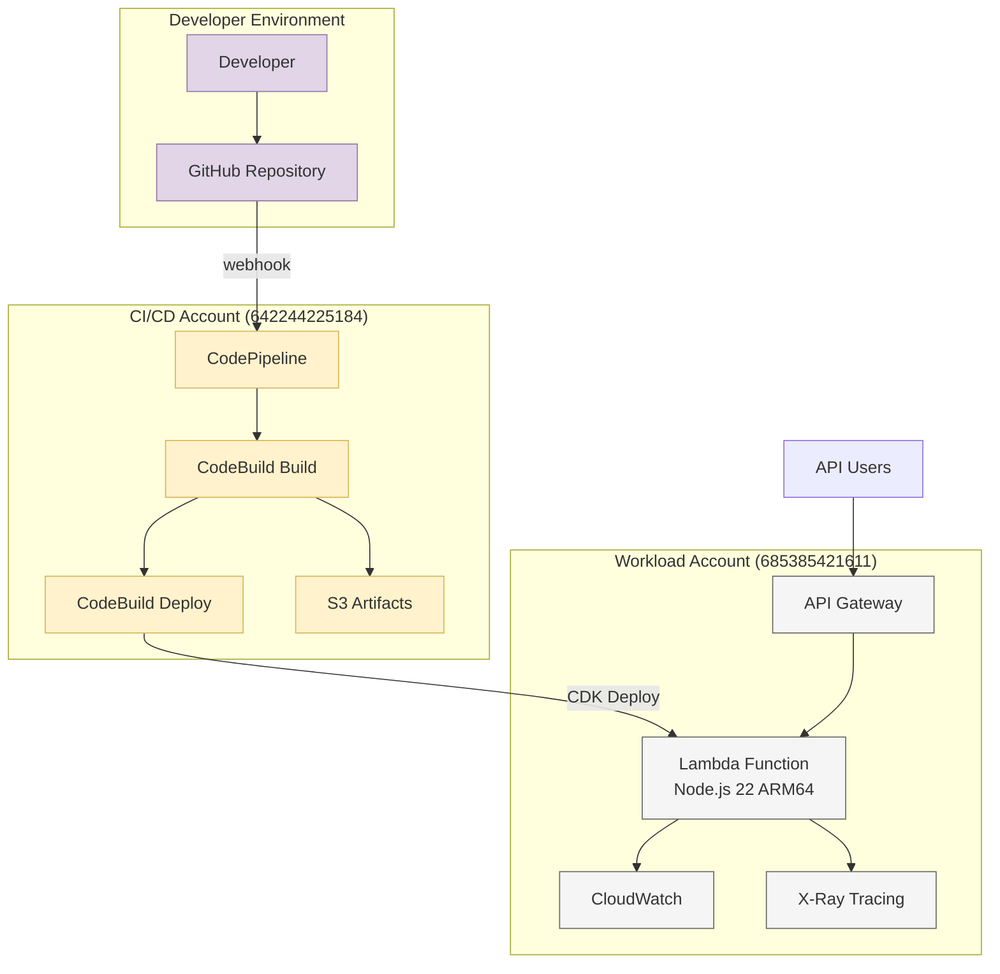
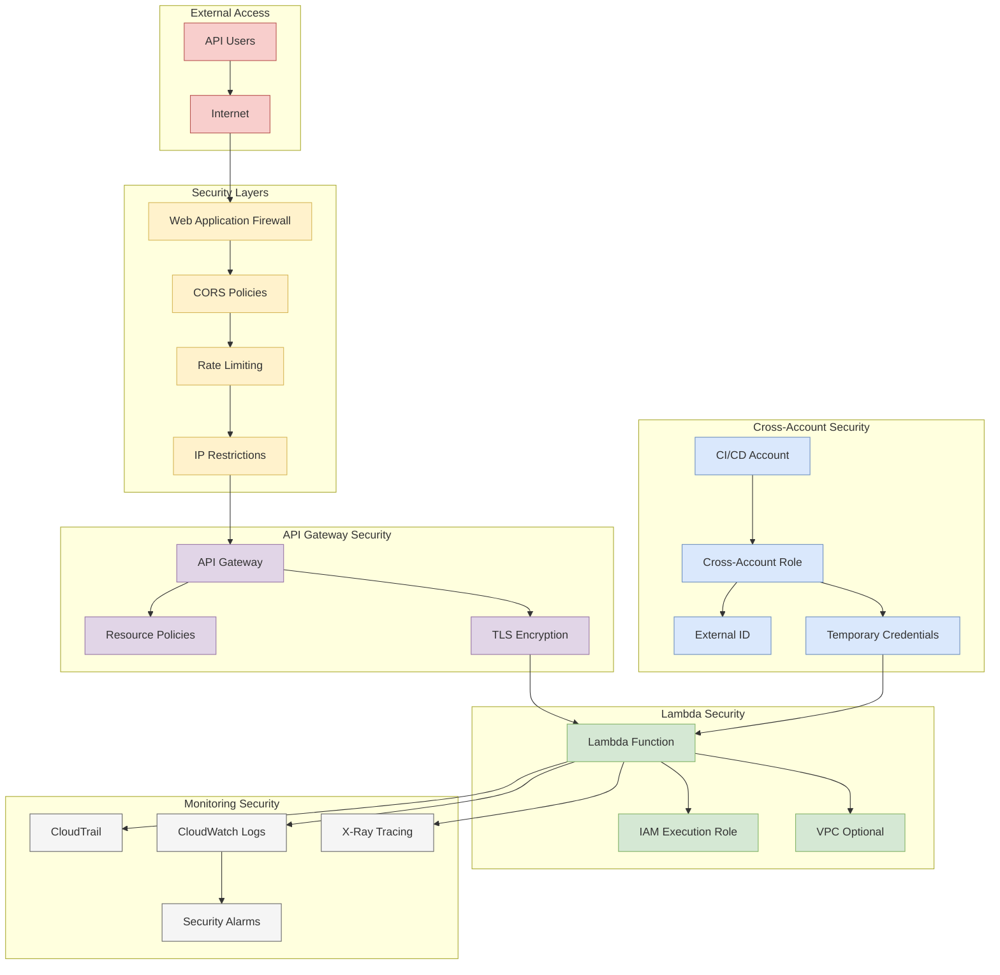
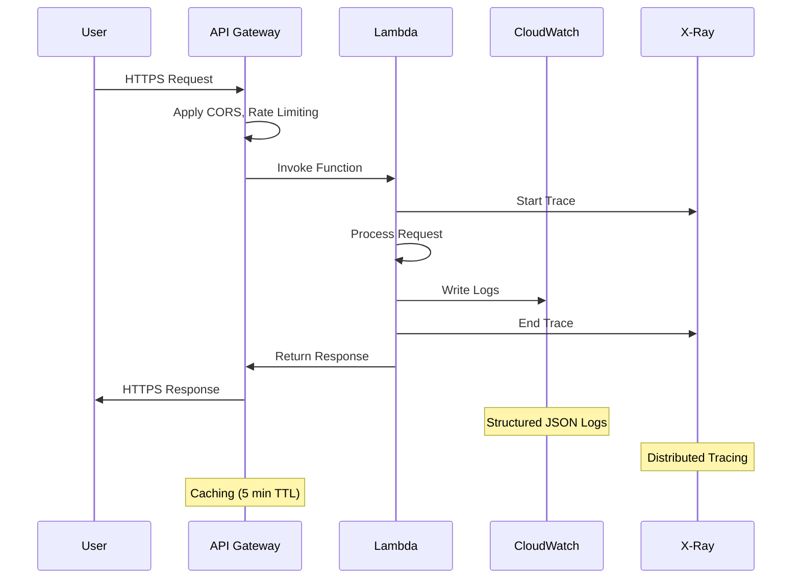
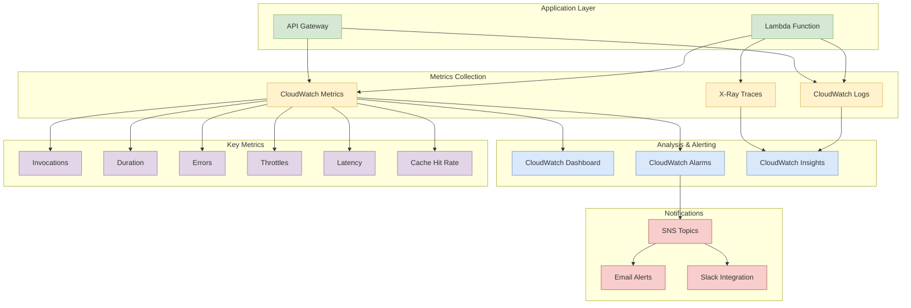
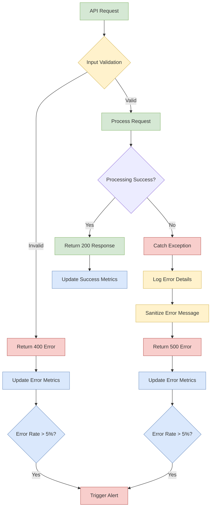

# Architecture Diagrams (Mermaid Format)

## System Architecture



## CI/CD Pipeline Flow

```mermaid
flowchart LR
    subgraph "Source Stage"
        A[Git Push] --> B[GitHub Webhook]
    end
    
    subgraph "Build Stage"
        C[CodeBuild Start]
        D[npm ci]
        E[npm test]
        F[npm run build]
        G[cdk synth]
        H[Store Artifacts]
        
        C --> D --> E --> F --> G --> H
    end
    
    subgraph "Deploy Stage"
        I[CodeBuild Deploy]
        J[Assume Cross-Account Role]
        K[cdk deploy]
        L[Update Lambda]
        
        I --> J --> K --> L
    end
    
    subgraph "Verification"
        M[Health Check]
        N[Smoke Tests]
        O[Monitor Metrics]
        
        L --> M --> N --> O
    end
    
    B --> C
    H --> I
    
    classDef sourceStage fill:#e1d5e7,stroke:#9673a6
    classDef buildStage fill:#fff2cc,stroke:#d6b656
    classDef deployStage fill:#d5e8d4,stroke:#82b366
    classDef verifyStage fill:#f8cecc,stroke:#b85450
    
    class A,B sourceStage
    class C,D,E,F,G,H buildStage
    class I,J,K,L deployStage
    class M,N,O verifyStage
```



## Security Architecture



## Data Flow Diagram



## Monitoring Architecture



## Cost Optimization Flow

```mermaid
graph TB
    subgraph "Architecture Decisions"
        ARM[ARM64 Architecture<br/>20% Cost Reduction]
        MEM[256MB Memory<br/>Price/Performance Optimized]
        CONC[Reserved Concurrency<br/>Cost Control]
    end
    
    subgraph "Operational Optimizations"
        LOG[7-Day Log Retention<br/>Storage Cost Reduction]
        CACHE[API Gateway Caching<br/>Reduced Invocations]
        CONN[Connection Reuse<br/>Performance Efficiency]
    end
    
    subgraph "Cost Monitoring"
        BUDGET[AWS Budgets<br/>$50/month Alert]
        COST[Cost Explorer<br/>Daily Monitoring]
        TAG[Cost Allocation Tags<br/>Resource Tracking]
    end
    
    subgraph "Monthly Cost Breakdown"
        LAMBDA[Lambda: $5-15]
        API[API Gateway: $3-10]
        CW[CloudWatch: $1-3]
        XR_COST[X-Ray: $1-2]
        TRANSFER[Data Transfer: $1-2]
        TOTAL[Total: $11-32/month<br/>vs Traditional: $200+]
    end
    
    ARM --> LAMBDA
    MEM --> LAMBDA
    CONC --> LAMBDA
    LOG --> CW
    CACHE --> API
    CONN --> LAMBDA
    
    BUDGET --> TOTAL
    COST --> TOTAL
    TAG --> TOTAL
    
    classDef arch fill:#d5e8d4,stroke:#82b366
    classDef ops fill:#fff2cc,stroke:#d6b656
    classDef monitor fill:#dae8fc,stroke:#6c8ebf
    classDef cost fill:#f8cecc,stroke:#b85450
    
    class ARM,MEM,CONC arch
    class LOG,CACHE,CONN ops
    class BUDGET,COST,TAG monitor
    class LAMBDA,API,CW,XR_COST,TRANSFER,TOTAL cost
```



## Deployment Strategy

```mermaid
gitgraph
    commit id: "Initial Setup"
    branch feature
    checkout feature
    commit id: "Feature Development"
    commit id: "Unit Tests"
    commit id: "Integration Tests"
    checkout main
    merge feature
    commit id: "Automated Deployment"
    commit id: "Production Release"
    branch hotfix
    checkout hotfix
    commit id: "Critical Fix"
    checkout main
    merge hotfix
    commit id: "Emergency Deploy"
```

## Error Handling Flow



---

**Note**: These Mermaid diagrams can be rendered in:
- GitHub (native support)
- GitLab (native support)
- VS Code (with Mermaid extension)
- Online at [mermaid.live](https://mermaid.live)
- Documentation sites (GitBook, Notion, etc.)

**Last Updated**: $(date)
**Format**: Mermaid
**Maintained By**: Architecture Team